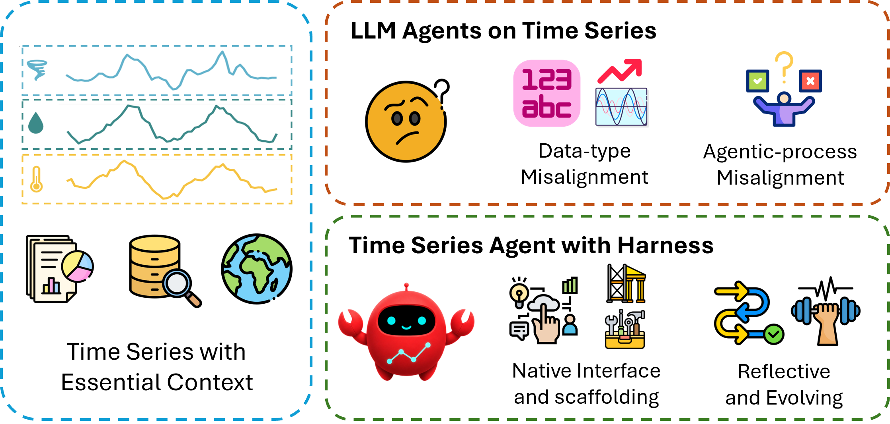
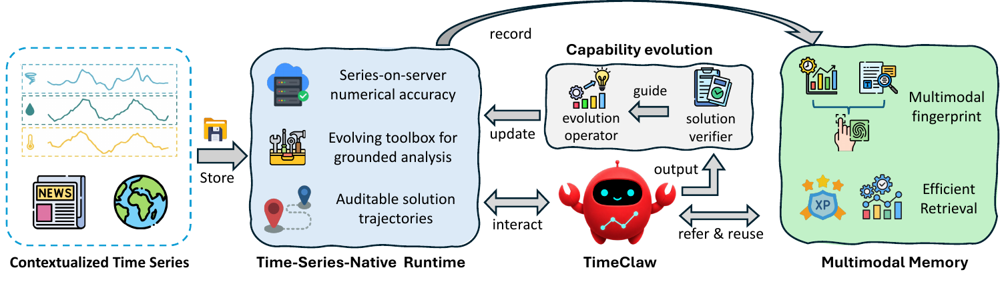

<div align="center">



# TimeClaw
### Harnessing Generalist Agents for Contextualized Time Series

Zihao Li · Kaifeng Jin · Yuanchen Bei · Jiaru Zou · Avaneesh Kumar · Xuying Ning ·<br/>
Yanjun Zhao · Mengting Ai · Baoyu Jing · Hanghang Tong · Jingrui He

[](https://arxiv.org/abs/2606.05404)
[](https://www.python.org/downloads/release/python-3110/)
[](https://opensource.org/licenses/Apache-2.0)

</div>

---

TimeClaw is a **time-series-native agent harness** that lets a generalist LLM
solve contextualized time-series tasks — forecasting with natural-language
context (CiK), reasoning over chart-style series (TSRBench), and quantitative
finance Q&A (TSAIA) — without finetuning the model. The agent is wrapped with
(1) a runtime that serves the raw series to MCP tools so numeric work stays
exact, (2) an episodic memory of past trajectories indexed by a multimodal
fingerprint, and (3) a capability-evolution loop that records, verifies, and
reuses successful problem-solving traces.

This repository contains the reference implementation and the full evaluation
harness on the three benchmarks above.

---

## ✨ What's inside

- **A single CLI** (`main.py`) that runs the same TimeClaw agent on CiK,
  TSRBench, or TSAIA, with deterministic train/test splits inside each task
  family.
- **In-process MCP tool server** (`timeclaw/tools/server.py`) — inspection,
  forecasting, anomaly, and finance-quant tools all served from a per-worker
  FastMCP instance so the agent never has to read raw numbers out of the
  prompt.
- **Memory bank** (`timeclaw/memory/`) — append-only JSONL store of
  trajectories, keyed by a deterministic ~20-dim series fingerprint, with an
  optional two-stage retrieval that first filters by NL-context cosine
  (`text-embedding-3-small`) and then ranks by fingerprint L2.
- **Three-line reproduction** per benchmark: `--mode train` populates the
  bank, `--mode test --k-neighbors 0` is the no-memory ablation,
  `--mode test --k-neighbors 3` is the full TimeClaw run.
- **Provider-agnostic** model layer — OpenAI `gpt-*`, Google `gemini-*`, and
  Anthropic `claude-*` all flow through LangChain `create_agent` and share
  the same tool-call loop.

---

## ⚙️ Environment Setup

```bash
conda create -n timeclaw python=3.11
conda activate timeclaw

pip install autogluon
pip install langchain langchain-openai langchain-google-genai
pip install langchain-mcp-adapters fastmcp
```


Then copy `.env.example` to `.env` and fill in at least one API key:

```bash
cp .env.example .env
# then edit .env to add OPENAI_API_KEY=...
```

Fetch the three benchmark datasets:

```bash
bash dataset_download.sh
```

The script pulls TSAIA and TSRBench from Hugging Face. CiK's
`all_tasks.json` is not on Hugging Face — download it from the official
Context-is-Key release and place it under `dataset_sources/CiK/`.

---

## 🚀 Quickstart

A full benchmark run is three commands: train (writes the memory bank), test
without memory (the k=0 baseline), and test with memory (the k=3 production
config). The train and test splits are deterministic for a fixed
`--split-seed` / `--train-ratio`, so the k=0 and k=3 runs evaluate on
**exactly the same records** — the comparison is apples-to-apples by
construction.

### TSRBench

```bash
# 1. Train (populates memory bank with grounded trajectories)
python main.py --benchmark tsrbench \
               --mode train --ratio 0.2 --subset all \
               --num-workers 32 --text-filter-size 20

# 2. Test, k=0 (no memory)
python main.py --benchmark tsrbench \
               --mode test --ratio 0.2 --subset all \
               --num-workers 32 --k-neighbors 0 --text-filter-size 0

# 3. Test, k=3 (TimeClaw with memory)
python main.py --benchmark tsrbench \
               --mode test --ratio 0.2 --subset all \
               --num-workers 32 --k-neighbors 3 --text-filter-size 20
```

### CiK

```bash
python main.py --benchmark cik \
               --mode train --train-ratio 0.5 --split-seed 2026 \
               --num-workers 16 --text-filter-size 20

python main.py --benchmark cik \
               --mode test --train-ratio 0.5 --split-seed 2026 \
               --num-workers 16 --k-neighbors 0 --text-filter-size 0

python main.py --benchmark cik \
               --mode test --train-ratio 0.5 --split-seed 2026 \
               --num-workers 16 --k-neighbors 3 --text-filter-size 20
```

CiK families can be filtered by NL-context type
(`--cik-context history,future,intemporal,covariates,causal`) — see
[`timeclaw/evaluation/cik.py`](timeclaw/evaluation/cik.py) for the full
mapping.

### TSAIA (multiple-choice split)

```bash
python main.py --benchmark tsaia \
               --mode train --ratio 1.0 --subset mc \
               --num-workers 32 --text-filter-size 20

python main.py --benchmark tsaia \
               --mode test --ratio 1.0 --subset mc \
               --num-workers 32 --k-neighbors 0 --text-filter-size 0

python main.py --benchmark tsaia \
               --mode test --ratio 1.0 --subset mc \
               --num-workers 32 --k-neighbors 3 --text-filter-size 20
```

`--subset mc` loads only the 150 MC items (VaR, SharpeRatio, MarketAB-alpha,
MarketAB-beta).

Each run lands at:

```
results/{benchmark}/{model}_{mode}[_{subset}][_k{k}]_r{ratio}_{date-time}/
  predictions.jsonl     # one row per task, scored
  trajectories.jsonl    # full LangChain message chain per task
  summary.json          # per-family / per-category / overall aggregation
  run_config.json       # exact CLI args this run was launched with
```

---

## 🧠 Method overview

<div align="center">

</div>

TimeClaw treats time-series problem solving as three coupled subsystems
around a single generalist LLM:

1. **Time-Series-Native Runtime.** The raw series stays on a per-worker
   MCP server. Tools (`series_overview`, `channel_stats`, `compute_acf`,
   `detect_periodicity`, `arima_forecast`, `portfolio_var`,
   `portfolio_sharpe`, `capm_regression`, …) operate directly on that
   server-side state, so the agent computes from real numbers instead of
   eyeballing a truncated text dump. Every tool call is logged into the
   trajectory, giving auditable solutions.
2. **Multimodal Memory.** Successful trajectories from training are
   distilled into a compact "analytic spine" (tool sequence + the
   `context_to_forecast` reasoning block the model emits) and stored in an
   append-only JSONL bank under a deterministic ~20-dim numerical
   fingerprint + an optional `text-embedding-3-small` vector over the NL
   context. At test time we retrieve top-k references and inject them as a
   prior block before the task.
3. **Capability evolution loop.** Train-mode runs reveal the ground truth
   to the agent and ask it to demonstrate the analytic process that
   justifies it, then verify the answer; only verified trajectories enter
   the bank. This produces a steadily-improving exemplar set that the same
   model can lean on at inference time without any weight updates.

---

## 🧱 Repository layout

```
TimeClaw/
├── main.py                          CLI dispatcher (--benchmark / --mode / --k-neighbors / ...)
├── dataset_download.sh              Pulls TSAIA + TSRBench from HF, scaffolds CiK
├── requirements.txt
├── .env.example                     Template for API keys
│
├── timeclaw/
│   ├── agents.py                    TimeClaw agent + per-worker MCP slot pool
│   ├── tools/server.py              In-process FastMCP server: ~15 analysis / finance tools
│   ├── evaluation/
│   │   ├── cik.py                   CiK loader, runner, RCRPS + sMAPE/MAAPE/MSE scorers
│   │   ├── tsrbench.py              TSRBench loader, runner, MCQ accuracy
│   │   ├── tsaia.py                 TSAIA loader, runner, MC + analysis scorers
│   │   ├── common.py                Subsampling, split, concurrent runner, output writer
│   │   ├── metrics.py               sMAPE / MAAPE / MSE / MAE / CRPS / RCRPS / accuracy
│   │   ├── parsers.py               MC letter, number, forecast (point + quantile) parsers
│   │   └── prompts.py               Tool-aware prompt builders per benchmark
│   ├── memory/
│   │   ├── fingerprint.py           ~20-dim numerical series descriptor
│   │   ├── text_embed.py            text-embedding-3-small wrapper
│   │   ├── store.py                 JSONL bank + L2 nearest-neighbor retrieval
│   │   └── summarize.py             Trajectory → compact reference block
│   └── utils/                       Model-provider routing, response parsing, paths
│
└── assets/
    ├── teaser.png
    ├── teaser.pdf
    ├── framework.png
    └── framework.pdf
```

Memory banks land at
`memory_banks/{benchmark}/{model}/seed{split_seed}_tr{tr}_r{ratio}/bank.jsonl`
and are append-only and idempotent on `task_id` — re-running `--mode train`
resumes from where a previous run stopped.

---

## 🔌 Supported models

| Provider  | How to invoke                              | Env vars used                            |
| --------- | ------------------------------------------ | ---------------------------------------- |
| OpenAI    | `--model gpt-5-nano` (or any `gpt-*` id)   | `OPENAI_API_KEY`                         |
| Google    | `--model gemini-2.5-flash` (or any `gemini-*`) | `GOOGLE_API_KEY`                     |
| Anthropic | `--model claude-sonnet-4-5` (or any `claude-*`) | `ANTHROPIC_API_KEY`, `ANTHROPIC_BASE_URL` (optional) |

All three flow through LangChain `create_agent` and share the same MCP
tool-call loop.

---

## 📚 Citation

If you use this code or build on TimeClaw, please cite:

```bibtex
@misc{li2026harnessinggeneralistagentscontextualized,
      title={Harnessing Generalist Agents for Contextualized Time Series},
      author={Zihao Li and Kaifeng Jin and Yuanchen Bei and Jiaru Zou and Avaneesh Kumar and Xuying Ning and Yanjun Zhao and Mengting Ai and Baoyu Jing and Hanghang Tong and Jingrui He},
      year={2026},
      eprint={2606.05404},
      archivePrefix={arXiv},
      primaryClass={cs.AI},
      url={https://arxiv.org/abs/2606.05404}
}
```

---

## 📜 License

This project is released under the [Apache 2.0 License](LICENSE).
